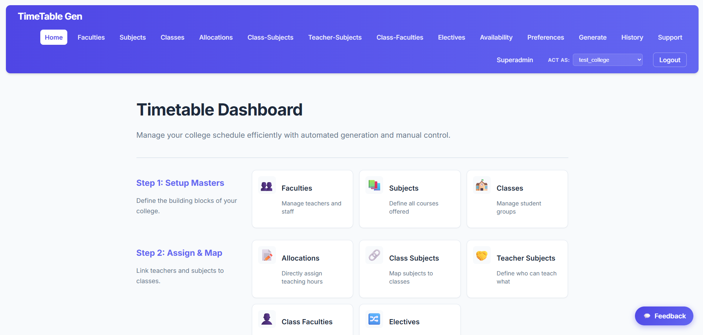
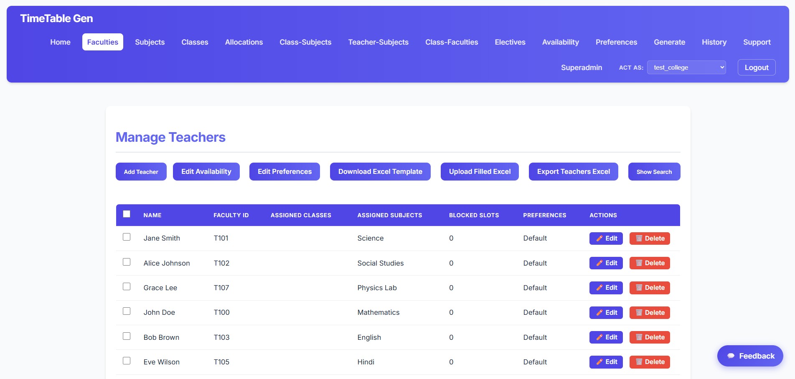
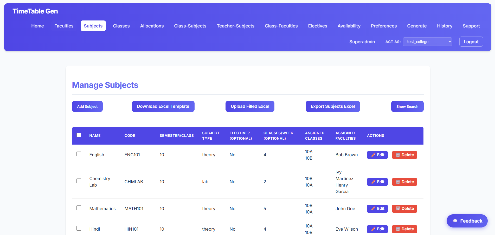
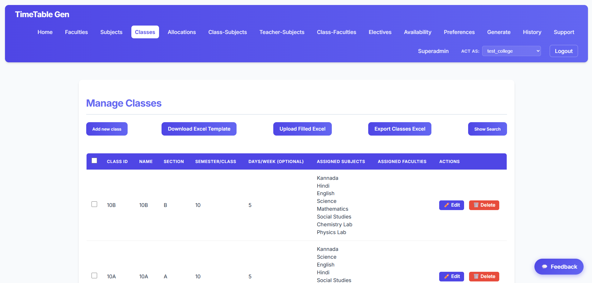
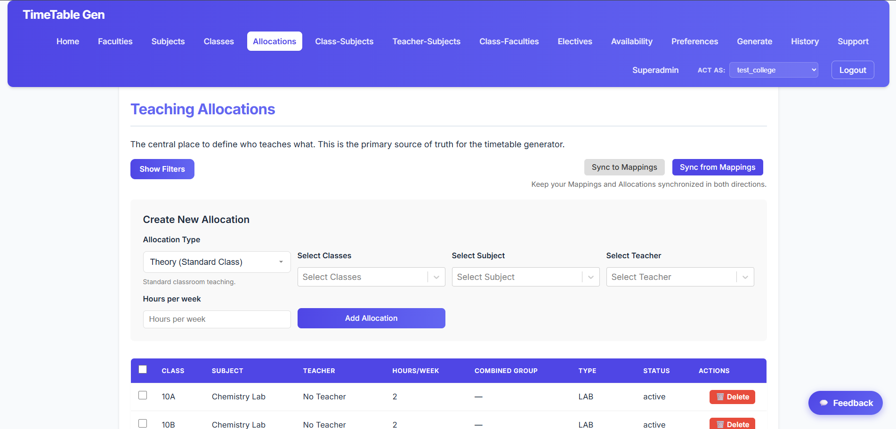
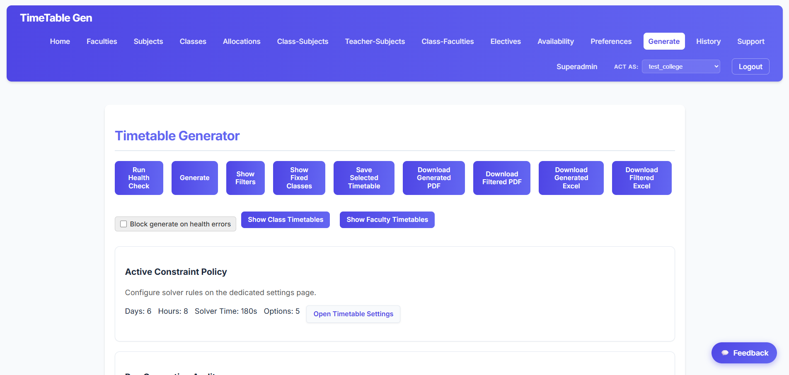
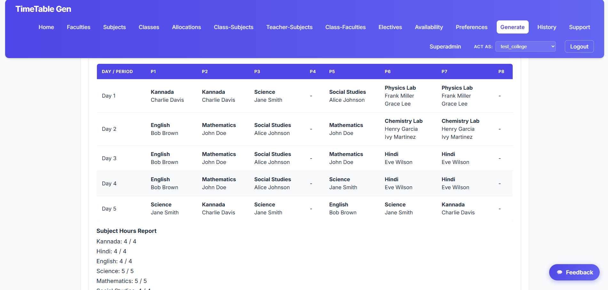

# Timetable Generator

A robust, full-stack timetable management and generation system designed for educational institutions. This system leverages Google's OR-Tools for constraint-based optimization and provides a modern, intuitive interface for managing complex scheduling needs.

## 🔗 Live Demo
[https://timetable-generator2.pages.dev](https://timetable-generator2.pages.dev)

## 🎥 Demo Video
A full walkthrough of the system can be found here: [Timetable Generator Demo](assets/Timetable%20generator%20demo.mp4)

## 🔑 Demo Credentials
For testing and presentation purposes, you can use the following dummy admin credentials:
- **Email:** `testcollegeadmin@test.com`
- **Password:** `test123abcadmin`

## 🚀 Features

- **Multi-Tenant Architecture:** Superadmin management of multiple colleges and localized admin control.
- **Smart Generation:** Constraint-aware timetable generation using Google OR-Tools.
- **Manual Refinement:** A drag-and-drop manual editor with real-time validation for fine-tuning results.
- **Master Data Management:** Comprehensive CRUD for Faculties, Subjects, Classes, and Class-Subject mappings.
- **Teaching Allocations:** Manage teacher-subject combinations and teaching loads efficiently.
- **Health Checks:** Pre-generation diagnostics to identify potential scheduling conflicts.
- **Excel Export:** Download generated timetables in professionally formatted Excel files.
- **Async Processing:** Background generation jobs with progress tracking.

## 📸 Screenshots

<div align="center">
  
  
  <br />
  
  
  <br />
  
  
  <br />
  
</div>

## 🛠 Tech Stack

### Frontend
- **Framework:** React 18+ with Vite
- **Styling:** Vanilla CSS (Modern CSS features)
- **State Management:** React Context API & TanStack Query (React Query)
- **Routing:** React Router DOM

### Backend
- **Runtime:** Node.js (ES Modules)
- **Framework:** Express.js
- **Database:** MongoDB with Mongoose ODM
- **Authentication:** JWT (JSON Web Tokens) with Cookie-based persistence
- **File Storage:** Cloudinary & AWS S3 (Optional)

### Solver Service
- **Language:** Python 3.10+
- **Framework:** FastAPI
- **Optimization Engine:** Google OR-Tools (CP-SAT Solver)
- **Data Handling:** Pydantic models

## 📂 Project Structure

```text
├── backend/              # Node.js Express API
│   ├── models/           # Mongoose schemas
│   ├── routes/           # API endpoints
│   ├── services/         # Business logic & Generator orchestration
│   ├── solver/           # Python-based optimization service
│   └── scripts/          # Database seeds and migrations
├── frontend/             # React application
│   ├── src/components/   # Reusable UI components
│   ├── src/pages/        # Page-level components
│   └── src/context/      # Global state providers
└── landing-page/         # Marketing site (Vite/React)
```

## 🚥 Getting Started

### Prerequisites
- Node.js 18.x
- Python 3.10+
- MongoDB instance (Local or Atlas)

### 1. Setup Backend
```bash
cd backend
npm install
cp .env.example .env  # Configure your MONGO_URI and JWT_SECRET
npm run dev
```

### 2. Setup Solver (Optional for local development)
```bash
cd backend/solver
python -m venv .venv
source .venv/bin/activate  # On Windows: .venv\Scripts\activate
pip install -r requirements.txt
uvicorn app:app --reload --port 8000
```

### 3. Setup Frontend
```bash
cd frontend
npm install
cp .env.example .env  # Set VITE_BACKEND_URL=http://localhost:5000/api
npm run dev
```

## 🧪 Testing

### Backend (Vitest)
```bash
cd backend
npm test
```

### Solver (Pytest)
```bash
cd backend/solver
pytest
```

## 📄 License
This project is licensed under the ISC License.

---
*Last updated: June 16, 2026*
